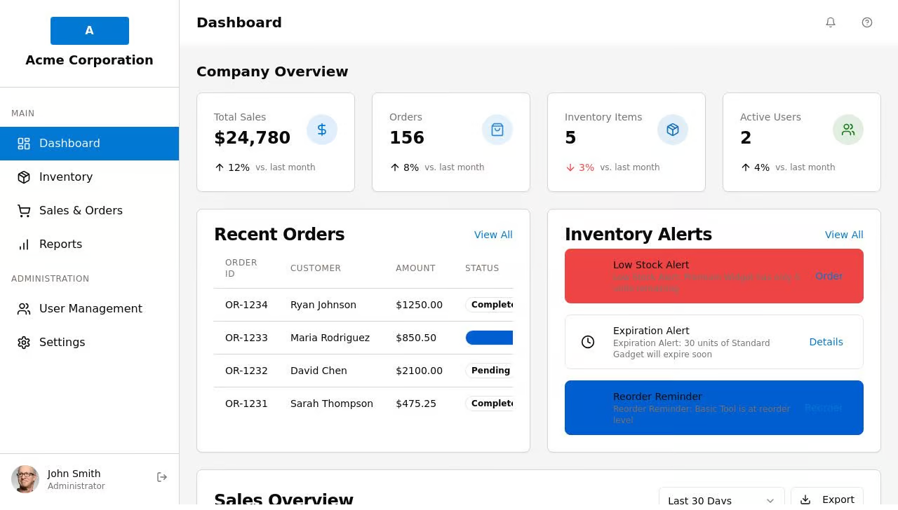

# White-Label ERP System

A customizable Enterprise Resource Planning (ERP) system built with React, Express, and modern web technologies. The system is designed to be white-labeled, allowing for custom branding while providing core business modules.




## Features

### Dashboard
- Real-time business metrics with trend indicators
- Visual sales charts with period selection
- Inventory alerts for low stock and reordering needs
- Recent orders overview with status tracking

### Inventory Management
- Complete product management system
- Inventory status tracking with visual indicators
- Low stock and reorder point alerts
- Import/export functionality for bulk management

### Sales & Orders
- Order tracking with multiple status options
- Sales analytics dashboard
- Order status management workflow
- Order filtering and search capabilities

### Reporting
- Customizable reports with different time periods
- Visual data representation with charts
- Exportable data formats
- Multiple report types (sales, inventory, orders)

### User Management
- Role-based access control
- User status management
- Secure authentication
- Profile management

### White-Labeling Features
- Custom company name configuration
- Primary and secondary color scheme customization
- Logo customization
- Module visibility configuration

## Technical Overview

### Frontend
- Built with React
- TanStack Query for data fetching and caching
- Shadcn UI components with Tailwind CSS for styling
- React Hook Form for form validation
- Recharts for data visualization
- Wouter for client-side routing

### Backend
- Express server
- In-memory storage (can be extended for database integration)
- RESTful API design
- Type-safe with TypeScript

## Getting Started

1. Clone the repository
2. Install dependencies:
   ```
   npm install
   ```
3. Start the development server:
   ```
   npm run dev
   ```
4. The application will be available at http://localhost:3000

## White-Labeling Guide

### Customizing Branding
1. Navigate to the Settings page
2. Update company name, logo, and colors
3. Save changes to see them applied across the application

### Module Configuration
The system comes with the following modules:
- Dashboard
- Inventory Management
- Sales & Orders
- Reports
- User Management
- Settings

Module visibility can be configured in the Settings page (coming in a future update).

## Development

### Project Structure
- `/client` - Frontend React application
- `/server` - Backend Express server
- `/shared` - Shared types and schema definitions

### Key Technologies
- React
- Express
- TypeScript
- TanStack Query
- Tailwind CSS
- Shadcn UI
- Recharts
- React Hook Form
- Zod (for validation)

## License

habizinnia@gmail.com